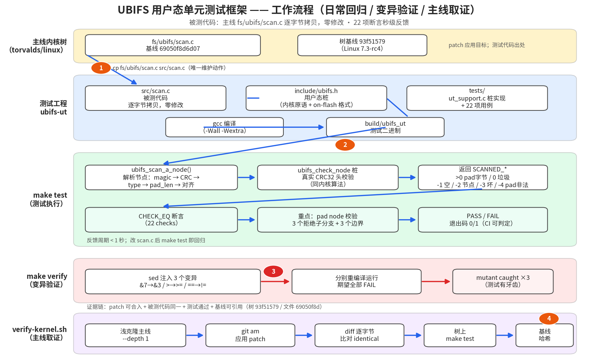

# UBIFS 用户态单元测试框架技术方案

| 项 | 内容 |
|---|---|
| 文档状态 | 定稿 |
| 日期 | 2026-09-21 |
| 适用对象 | 面试题："给主线 linux 内核 fs/ubifs 添加单元测试框架" |
| 前置验证 | 已在 x86（Windows/TinyCC）与 aarch64（鲲鹏 ECS/gcc）双平台全流程跑通：22 项断言全过、3 个注入回归全部检出、主线树 `git am` 取证完成（见第 8 节） |
| 基线 | 树 `93f51579e7df`（Linux 7.3-rc4，2026-09-20）；文件 `fs/ubifs/scan.c @ 69050f8d6d07` |

## 0. 文档导读

- 第 1 节：需求与结论（只看一页即可了解方案）。
- 第 2 节：术语、返回值与基线口径。
- 第 3 节：需求分析与方案推导（五步推导链：定位被测对象 → 排除法核算候选路径 → 保真前提 → 边界压力测试 → 决策追溯）。
- 第 4 节：候选方案对比与选型。
- 第 5 节：总体架构与工作流程（图 5-1）。
- 第 6 节：详细设计（桩头文件、CRC 桩、节点构造器、用例矩阵、变异机制、取证脚本）。
- 第 7 节：关键代码分析（`ubifs_scan_a_node` 全分支拆解）。
- 第 8 节：测试与验收（双平台、变异验证、树上取证）。
- 第 9 节：风险与对策。
- 第 10 节：面试 Q&A。
- 第 11 节：扩展路线（面试题第 2 问：journal replay）。
- 附录 A：踩坑清单。附录 B：参考资料。

## 1. 概述

### 1.1 需求

面试题要求：给主线内核 `fs/ubifs` 添加单元测试框架——

1. 测试 `ubifs_scan_a_node()` 是否如预期工作（选可能性最大的 1 点即可，不要求完整覆盖）；
2. 找出 UBIFS 中逻辑复杂/重要的环节，写部分单元测试；
3. 目的：**未来其他人改了函数几行代码，能快速离线验证行为正确性，而不是上开发板实测**；
4. 交付 patch，并说明 patch 对应主线哪个 commit。

考察点：测试代码的正确性；能否找到 UBIFS 核心业务逻辑。

### 1.2 结论（方案一句话）

> **把未修改的主线 `fs/ubifs/scan.c` 逐字节拷贝进测试工程，用一份用户态桩头文件替代内核环境，在用户态直接编译执行；用与内核同语义的 CRC32 桩复刻 `ubifs_check_node` 的头部校验，使全部返回值分支（含损坏节点）真实可达；测试重点覆盖 padding node 校验分支，共 22 项断言；`make test` 秒级回归，`make verify` 注入 3 个变异证明测试有牙齿；patch 为纯新增文件，可 `git am` 到任意主线树，并锁定树/文件双基线 commit。**

### 1.3 关键决策摘要

| # | 决策 | 理由（详见） |
|---|---|---|
| 1 | 用户态 stub 编译，不用 KUnit / MTD 模拟器 | 唯一满足"秒级、零环境、CI 友好"的路径（3.3） |
| 2 | 被测代码零修改、逐字节拷贝 | 保证"测的就是主线代码"，取证可用 `diff` 闭环（3.4、8.4） |
| 3 | on-flash 结构体/常量与内核逐一对齐 | 桩语义漂移会让测试"自洽但无效"（3.5，附录 A-1） |
| 4 | `ubifs_check_node` 桩保留真实 CRC32 头校验 | 让 `SCANNED_A_CORRUPT_NODE` 分支真实可达（6.2） |
| 5 | 测试聚焦 pad node 校验分支 | 挂载/GC 扫描命中率最高、逻辑最密的决策点（3.2、7） |
| 6 | patch 只新增 `tools/testing/ubifs/`，不动 `fs/ubifs/` | 上游零侵入，review 无争议（5.2） |
| 7 | 树基线 + 文件基线双哈希取证 | 精确回答"patch 对应主线哪个 commit"（2.2、8.4） |

## 2. 术语、返回值与基线口径

### 2.1 术语

| 术语 | 定义 |
|---|---|
| LEB | 逻辑擦除块（Logical Eraseblock），UBI 卷上的分配单位，`c->leb_size` 通常 128 KiB |
| bud | 日志子区，journal 写数据时按顺序追加节点的 LEB |
| sqnum | 节点头部 64 位序列号，全文件系统单调递增，replay 时决定版本新旧 |
| `ubifs_ch` | 所有节点的公共头部（magic/crc/sqnum/len/type，共 24 字节） |
| pad node | 补齐节点：写到 LEB 末尾前用于填充、使后续节点 8 字节对齐的合法节点 |
| 桩（stub） | 用户态替代实现：用 libc 模拟内核原语（list、kmalloc、调试宏等） |
| 变异（mutant） | 故意注入被测代码的微小回归，用于检验测试套件的检出能力 |

### 2.2 返回值与基线口径

**`ubifs_scan_a_node()` 返回值口径**（内核 `ubifs.h` 原文约定，逐字对齐）：

| 返回值 | 含义 | 测试口径 |
|---|---|---|
| `> 0` | 扫描到 N 个裸 padding 字节（调用方按此跳过） | 断言具体字节数 |
| `0` | `SCANNED_GARBAGE` 垃圾 | 断言 |
| `-1` | `SCANNED_EMPTY_SPACE` 空空间（0xFF） | 断言 |
| `-2` | `SCANNED_A_NODE` 合法节点 | 断言 |
| `-3` | `SCANNED_A_CORRUPT_NODE` 头 CRC/长度校验失败 | 断言 |
| `-4` | `SCANNED_A_BAD_PAD_NODE` pad 节点非法 | 断言 |

**基线口径**（面试时两个哈希都要说，含义不同）：

- **树基线**：patch 应用目标的内核树快照 commit（当前 `93f51579e7df`，Linux 7.3-rc4）。回答"patch 基于哪个 commit"。
- **文件基线**：`fs/ubifs/scan.c` 最后被修改的 commit（当前 `69050f8d6d07`）。回答"被测代码对应哪个版本"。

**验证口径**：验收以第 8 节为准；22 项断言全过 + 3 个变异全部检出 + 树上取证通过，三者缺一不算完成。

## 3. 需求分析与方案推导

### 3.1 第一步：把题目翻译成可验证的约束

| 题目关键词 | 工程约束 |
|---|---|
| "改了函数几行代码，快速验证" | 反馈周期必须秒级；单命令；退出码可被 CI 判定 |
| "而不是去开发板实际模拟" | 不依赖 MTD/UBI/闪存硬件、不需要 root、不需要 VM |
| "找 ubifs 核心业务逻辑" | 被测点必须在关键路径上，且是"改了会出事"的那种 |
| "提交 patch + 对应主线 commit" | 交付物可 `git am`；基线可举证、可复现 |

### 3.2 第二步：定位被测对象——为什么是 `ubifs_scan_a_node()`

UBIFS 挂载主流程（`super.c: mount_ubifs`）的关键路径：

```
mount_ubifs()
 ├─ ubifs_read_superblock()     读 LEB0 超级块
 ├─ ubifs_read_master()         读 master node，判断是否需要 recovery
 ├─ ubifs_lpt_init()            加载 LEB 属性表
 ├─ ubifs_replay_journal()      ★ 重放日志：逐 bud LEB 调用 ubifs_scan()
 │     └─ ubifs_scan_a_node()   ★ 解析每个节点：magic/CRC/类型/长度/pad 校验
 ├─ ubifs_mount_orphans()       孤儿 inode 处理
 └─ recovery 路径（如需）
```

`scan.c` 文件头注释明确写着：scan 用于 **journal replay、GC、TNC in-the-gaps、调试函数**——即所有介质读取都汇聚到 `ubifs_scan_a_node()`。它是"改了会出事"的典型：返回值判错一个分支，挂载要么失败、要么把损坏节点当合法节点收下（数据损坏）。

函数内部选择 pad node 校验分支作为测试重点（第 1 问"可能性最大的 1 点"）的理由：

1. **命中频率最高**：日志/GC 扫描中 pad 节点与裸 padding 字节是常态，每次扫描必经；
2. **逻辑最密**：三个拒绝子分支（越界、负值、对齐）+ 边界条件（恰好结束在 LEB 末尾），是最容易改出回归的地方；
3. **安全性敏感**：pad_len 来自介质，恶意镜像可构造极端值，校验分支是防线。

### 3.3 第三步：候选路径排除法核算

#### 路径 A：KUnit（内核内单元测试框架）——核算出局

- KUnit 用例在内核里编译，需要完整内核构建 + 启动环境（QEMU/真机）；
- UBIFS 没有现成 KUnit 基础设施，被测函数依赖 `ubifs_info`、UBI 层、CRC、内存分配，桩面比被测代码本身大得多；
- 反馈周期：内核构建分钟级起。**不满足 3.1 的"秒级"约束。**

#### 路径 B：nandsim / mtdram + 真实挂载 UBIFS 卷——核算出局

- 需要 root、MTD 子系统、ubiattach/mkfs.ubifs/mount 全套工具链；
- 单次验证分钟级，且依赖模拟器保真度（模拟器自身的 bug 会污染结论）；
- CI 环境搭建成本高。**不满足"零环境、CI 友好"约束。**

#### 路径 C：用户态 stub 编译——核算通过

- `scan.c` 是纯解析逻辑：输入是字节缓冲 + `leb_size` 等少量标量，不依赖调度器/锁/真实 I/O——**这是它能被搬出内核的根本原因**；
- 依赖面可控：只需桩化 `ubifs_info` 两个字段、`list_head`、kmalloc 宏、调试宏、`ubifs_check_node`、`ubifs_leb_read`；
- 反馈周期：秒级，单命令 `make test`，退出码 0/1 可直接挂 CI。

#### 核算结论

选路径 C。代价是无法覆盖与内核交互的路径（见第 9 节风险 R1），但对"节点解析/校验"这一类纯逻辑，用户态 stub 的保真度可以做到 100%。

### 3.4 第四步：验证保真前提（这个解成立吗）

用户态 stub 方案成立的前提是"测的确实是内核那份代码"，三个前提逐一验证：

1. **代码同一性**：`src/scan.c` 从内核树逐字节拷贝，用 `diff` 闭环（8.4 节实测 identical）；
2. **语义同一性**：on-flash 结构体（`ubifs_ch` 等）与 `ubifs-media.h` 逐字段一致；`SCANNED_*` 返回值语义一致——见附录 A-1，我最初在这里踩过坑（把返回值错记成 0~4），导致集成测试把 `SCANNED_A_NODE(-2)` 当 padding 长度跳过；
3. **校验同一性**：`ubifs_check_node` 桩复刻内核版本对扫描有意义的检查（头长度 + common header CRC32），CRC 算法与内核 `crc32()` 同多项式同初值，因此 `-3` 分支真实可达（6.2）。

### 3.5 第五步：边界压力测试（什么情况下推导会失效）

| 边界 | 失效场景 | 对策 |
|---|---|---|
| 主线漂移 | scan.c 更新后测试过期 | 维护动作：`cp fs/ubifs/scan.c src/scan.c`；`verify-kernel.sh` 自动检测并更新 |
| 语义漂移 | 内核改了结构体/返回值约定 | `diff` + 编译错误双重暴露；README 记录基线哈希便于比对 |
| 字节序 | big-endian 主机上 `le32_to_cpu` 恒等映射错误 | 桩中显式假设小端并在 README/INTERVIEW 标注（风险 R2） |
| 桩保真度 | `check_node` 桩过弱，漏检真实内核会拒的节点 | 桩保留真实 CRC 校验；已知差异（`c->ranges[]` 长度范围表）在 9 节声明 |
| 编译器差异 | tcc/gcc 行为差异 | 双平台实测（8.2），gcc `-Wall -Wextra` 无警告 |

### 3.6 决策追溯表

| 决策（1.3） | 推导步骤 |
|---|---|
| 1 用户态 stub | 3.3 路径 A/B 出局核算 |
| 2 被测代码零修改 | 3.4 前提 1 |
| 3 结构体/常量对齐 | 3.4 前提 2（附录 A-1 踩坑实证） |
| 4 CRC 桩保真 | 3.4 前提 3 |
| 5 聚焦 pad node | 3.2 三步理由 |
| 6 patch 零侵入 | 3.1 "提交 patch" 约束 |
| 7 双基线取证 | 3.1 "对应主线 commit" 约束 |

## 4. 方案对比与选型

| 维度 | A. KUnit | B. MTD 模拟器 | **C. 用户态 stub（选定）** |
|---|---|---|---|
| 反馈周期 | 分钟级（内核构建） | 分钟级（模拟器+挂载） | **秒级** |
| 环境依赖 | 内核构建+启动环境 | root+MTD 工具链+VM | **仅 gcc** |
| 被测代码保真 | 高（内核内） | 中（模拟器保真度干扰） | **高（逐字节+语义对齐）** |
| 桩工作量 | 大（无现成设施） | 小 | 中（可控清单） |
| CI 友好 | 弱 | 弱 | **强（退出码即结论）** |
| 覆盖交互路径 | 能 | 能 | 不能（见 R1） |

## 5. 总体架构

### 5.1 工作流程（图 5-1）



（图由 `draw_workflow.py` 生成，覆盖三条流：日常回归流、变异验证流、主线取证流。）

### 5.2 目录结构与交付形态

```
ubifs-ut/                      # GitHub 仓库（完整工程）
├── include/ubifs.h            # 用户态桩头文件
├── src/scan.c                 # 被测代码（主线逐字节拷贝）
├── tests/                     # 桩实现 + 22 项用例
├── Makefile                   # make / make test / make verify
├── verify-kernel.sh           # 主线树一键取证
├── INTERVIEW.md               # 面试自述稿
├── docs/                      # 本文档
└── patches/0001-...patch      # 内核 patch（7 个新增文件，零侵入）

内核树内落地形态（patch 应用后）：
tools/testing/ubifs/           # 纯新增，不触碰 fs/ubifs/ 任何一行
├── include/ src/ tests/ Makefile README.md
```

## 6. 详细设计

### 6.1 假设与前提

- 主机小端（x86/aarch64）；C99 编译器；被测代码以 `fs/ubifs/scan.c @ 69050f8d6d07` 为准；
- 内核侧函数语义以 `fs/ubifs/ubifs.h`、`ubifs-media.h`、`io.c` 为准。

### 6.2 桩头文件设计（include/ubifs.h）

分三层，职责严格分离：

1. **内核原语桩**（必须行为等价）：`list_head` 全套操作、`kmalloc/kzalloc`、`ERR_PTR/IS_ERR`、`cond_resched`、调试宏；
2. **on-flash 格式定义**（必须与 `ubifs-media.h` 逐字段一致）：`ubifs_ch`、`ubifs_pad_node`、`ubifs_ino_node`、`UBIFS_NODE_MAGIC`、`UBIFS_PADDING_BYTE`、节点类型枚举、`UBIFS_*_NODE_SZ`；
3. **返回值约定**（必须与 `ubifs.h` 一致）：`SCANNED_*` 枚举——**正数保留给 padding 长度，节点码 ≤ 0**。

### 6.3 `ubifs_check_node` 桩与 CRC 语义

内核版（`io.c`）对扫描路径有意义的检查 = 头长度合法 + common header CRC 通过：

```
crc = crc32(UBIFS_CRC32_INIT, ch + 8, UBIFS_CH_SZ - 8)   # 跳过 magic+crc
```

桩用查表法实现同多项式（0xEDB88320）同初值 CRC32，测试辅助函数 `ut_make_node()` 按同样口径计算头 CRC——**构造与校验同源，但算法与内核一致**，因此"合法节点"和"CRC 损坏节点"两个方向的分支都真实可达。桩未实现内核的 `c->ranges[]` 类型长度范围表，已在风险 R3 声明。

### 6.4 节点构造器

- `ut_make_node(buf, type, len, sqnum)`：填公共头 + 算头 CRC，模拟内核写节点；
- `ut_make_pad_node(buf, node_len, pad_len, sqnum)`：在公共头后填 `pad_len`；
- 测试可在此基础上"注入异常"（改 CRC、改 pad_len 为 0x80000000 等），构造坏节点。

### 6.5 测试用例矩阵（22 项断言）

**重点组：pad node 校验（面试题第 1 问选点）**

| 用例 | 输入 | 期望 | 覆盖分支 |
|---|---|---|---|
| test_valid_pad_node | pad_len=36，offs=0x100 | 返回 64 | 合法路径 |
| test_pad_node_overruns_leb | pad_len=leb_size | -4 | `offs+node_len+pad_len > leb_size` |
| test_pad_node_negative_pad_len | pad_len=0x80000000 | -4 | `pad_len < 0`（有符号解释） |
| test_pad_node_misaligned_total | 28+2=30 | -4 | `(node_len+pad_len)&7` |
| test_pad_node_36_bytes_is_misaligned | 28+8=36 | -4 | 区分 `&7` 与弱校验 `&3` |
| test_pad_node_ends_exactly_at_leb_end | 恰好结束在 LEB 末尾 | 返回 64 | 边界：`>` 而非 `>=` |

**其余分支组**

| 用例 | 期望 |
|---|---|
| test_empty_space（全 0xFF） | -1 |
| test_raw_padding_bytes（16×0xCE） | 16 |
| test_raw_padding_misaligned（10×0xCE） | 0 |
| test_garbage | 0 |
| test_len_too_small（len<24） | 0 |
| test_corrupt_header_crc | -3 |
| test_valid_plain_node（CS 节点） | -2 |
| test_ubifs_scan_collects_nodes（集成：手工 LEB 含 2 CS 节点 + 1 pad 节点） | nodes_cnt=2、offs/sqnum/endpt 逐项断言 |

### 6.6 Makefile 目标与变异机制

- `make`：编译 `build/ubifs_ut`；
- `make test`：编译+运行，末尾输出 `PASS/FAIL`，退出码 0/1（CI 可直接判定）；
- `make verify`：用 `sed` 对 `src/scan.c` 注入 3 个变异（`&7→&3`、`>→>=`、`==→!=`），分别编译运行，**期望全部失败退出**——若某变异"存活"（测试通过），打印 `MUTANT NOT CAUGHT` 并以非零码退出。这是"测试有牙齿"的机器证明。

### 6.7 `verify-kernel.sh` 取证流程

五步：浅克隆主线（可复用已有克隆）→ `git am` 应用 patch → `diff` 逐字节比对 → 树上 `make test` → 打印树基线哈希。全程自动，产出可直接引用的证据链。

## 7. 关键代码分析：`ubifs_scan_a_node` 分支拆解

```c
magic = le32_to_cpu(ch->magic);
if (magic == 0xFFFFFFFF)            return SCANNED_EMPTY_SPACE;   // -1
if (magic != UBIFS_NODE_MAGIC)      return scan_padding_bytes(...);// 0 或 >0
if (len < UBIFS_CH_SZ)              return SCANNED_GARBAGE;       // 0
if (ubifs_check_node(...))          return SCANNED_A_CORRUPT_NODE;// -3
if (ch->node_type == UBIFS_PAD_NODE) {
    if (pad_len < 0 || offs + node_len + pad_len > c->leb_size)
        return SCANNED_A_BAD_PAD_NODE;                            // -4
    if ((node_len + pad_len) & 7)
        return SCANNED_A_BAD_PAD_NODE;                            // -4
    return node_len + pad_len;                                    // >0 跳过
}
return SCANNED_A_NODE;                                            // -2
```

要点：

1. **返回值约定不对称**：正数留给 padding 字节数（调用方 `ubifs_scan` 的 `if (ret > 0)` 直接当跳过长度），节点码全部 ≤ 0——写桩时把枚举值抄错（0~4）会让集成测试行为全乱（附录 A-1）；
2. **`scan_padding_bytes` 的对齐约束**：裸 padding 必须非 0 且 8 字节对齐，否则按垃圾处理——这是裸字节流与"垃圾"的区分线；
3. **pad node 三个拒绝子分支的顺序**：先边界/负值、后对齐；`>` 而非 `>=` 意味着"恰好结束在 LEB 末尾"合法——边界用例专门锁定这一点；
4. **校验委托**：节点好坏的判定委托给 `ubifs_check_node`（CRC），pad 节点的语义合法性由本函数自己判——两个层次不要混。

## 8. 测试与验收

### 8.1 测量方法

`make test` 输出 `ubifs_scan_a_node: N checks, M failures`；任一断言失败打印文件/行号/期望值/实际值；进程退出码非零。

### 8.2 已完成的验证矩阵（实测）

| 验证项 | 平台 | 结果 |
|---|---|---|
| `make test` | x86 Windows / TinyCC | 22 checks, 0 failures |
| `make test` | aarch64 鲲鹏 ECS / gcc | 22 checks, 0 failures |
| `make verify`（3 变异） | aarch64 | 3/3 全部 caught |
| `git am` + `diff identical` + 树上 `make test` | aarch64（树 93f51579） | 全部通过 |

### 8.3 验收门槛

① 22 项断言全过；② 3 个变异全部被检出；③ 主线树上 `git am` 干净应用且 `diff` identical。三者同时满足才算交付完成。

### 8.4 归因纪律

任何失败必须归因到具体用例/具体分支，不允许"重跑一遍就好了"；主线漂移导致的失败必须先 `diff` 确认漂移再更新被测拷贝。

## 9. 风险与对策

| # | 风险 | 影响 | 对策 |
|---|---|---|---|
| R1 | 用户态测不了内核交互路径（锁、调度、真实 I/O） | 覆盖盲区 | 声明边界；扫描层是纯解析逻辑，盲区不在本框架目标内 |
| R2 | big-endian 主机 | `leXX_to_cpu` 桩失效 | 显式声明小端假设；big-endian 需改桩（约 10 行） |
| R3 | `check_node` 桩未实现 `c->ranges[]` 长度范围表 | 极长/极短节点的类型级校验缺失 | 已在文档声明；需要时按 `init_constants_early` 补表 |
| R4 | 主线 scan.c 漂移 | 测试过期 | `verify-kernel.sh` 自动 diff + 更新；基线哈希双记录 |
| R5 | 变异验证的 sed 规则随 scan.c 漂移失效 | verify 假阳性 | sed 规则失效时编译失败即报警（会被判为 caught，需人工复核规则） |

## 10. 面试 Q&A（预埋）

**Q：为什么 SCANNED 返回值是 0 和负数？**
A：正数要留给"裸 padding 字节数"——`ubifs_scan` 里 `if (ret > 0)` 直接当跳过长度用。我最初凭印象写成 0~4，集成测试立刻暴露（节点码被当 padding 跳过），核对 `ubifs.h` 才改对。这个坑让我确认了"桩语义必须与内核逐一对齐"。

**Q：怎么证明你测的就是主线代码？**
A：三层证据——`src/scan.c` 逐字节拷贝 + `diff` identical 闭环 + patch 描述里双基线哈希（树 93f51579、文件 69050f8d）。

**Q：和 KUnit 比缺点是什么？**
A：跑不到内核里，覆盖不了交互路径；换来秒级反馈和零环境依赖。对扫描层这种纯解析逻辑，保真度 100%、性价比最高。

**Q：浅克隆 `git log -- <路径>` 为什么查不到文件基线？**
A：深度 1 的边界提交没有父提交，git 无法 diff，路径过滤不可靠（会误显示快照提交）。文件基线用 GitHub API 或完整历史查。

**Q：第 2 问如果让你现在做？**
A：选 journal replay 中不依赖 TNC 的纯决策逻辑（按 sqnum 选生效版本），用 `ut_make_node()` 构造多版本节点序列直接断言；扫描层的 `ubifs_scan()` 集成测试已演示 LEB 图像构造方法。

## 11. 扩展路线（面试题第 2 问：journal replay）

replay 的核心正确性问题：**同一 inode 的多个节点版本散布在不同 bud LEB，重放必须按 sqnum 决定谁生效，trun 节点改变生效尺寸**。扩展步骤：

1. 用 `ut_make_node()` 构造带不同 sqnum 的 ino/data/trun 节点序列；
2. 按 `ubifs_scan()` 输出格式（`ubifs_scan_leb` 链表）组装多 LEB 输入；
3. 对 replay 的纯决策函数（版本选择/截断生效判定）直接喂数据断言；
4. 需要桩化的新依赖：bud 链表、`ubifs_info` 扩展字段——控制在 replay 纯函数边界内，不引入 TNC。

## 附录 A：踩坑清单

| # | 坑 | 教训 |
|---|---|---|
| A-1 | `SCANNED_*` 错记为 0~4 | 常量/返回值必须抄内核原文；集成测试能抓住单测抓不住的桩错误 |
| A-2 | Windows `core.autocrlf` 导致 `diff` 逐字节比对误报 | 取证脚本在 Linux 上跑；或 `git -c core.autocrlf=false clone` |
| A-3 | 集成测试忘设 `c.min_io_size=0` 触发除零 | 静态结构体每个字段都要有意识初始化 |
| A-4 | 浅克隆路径过滤 `git log` 显示边界提交 | 文件基线查 API，树基线看 HEAD |

## 附录 B：参考资料

- `fs/ubifs/scan.c @ 69050f8d6d075dc01af7a5f2f550a8067510366f`（被测代码）
- `fs/ubifs/ubifs.h`（SCANNED_* 返回值定义）
- `fs/ubifs/ubifs-media.h`（on-flash 格式定义）
- `fs/ubifs/super.c`（挂载主流程）
- 树基线：`93f51579e7df248780214094418f205253383cc5`（Linux 7.3-rc4，2026-09-20）
